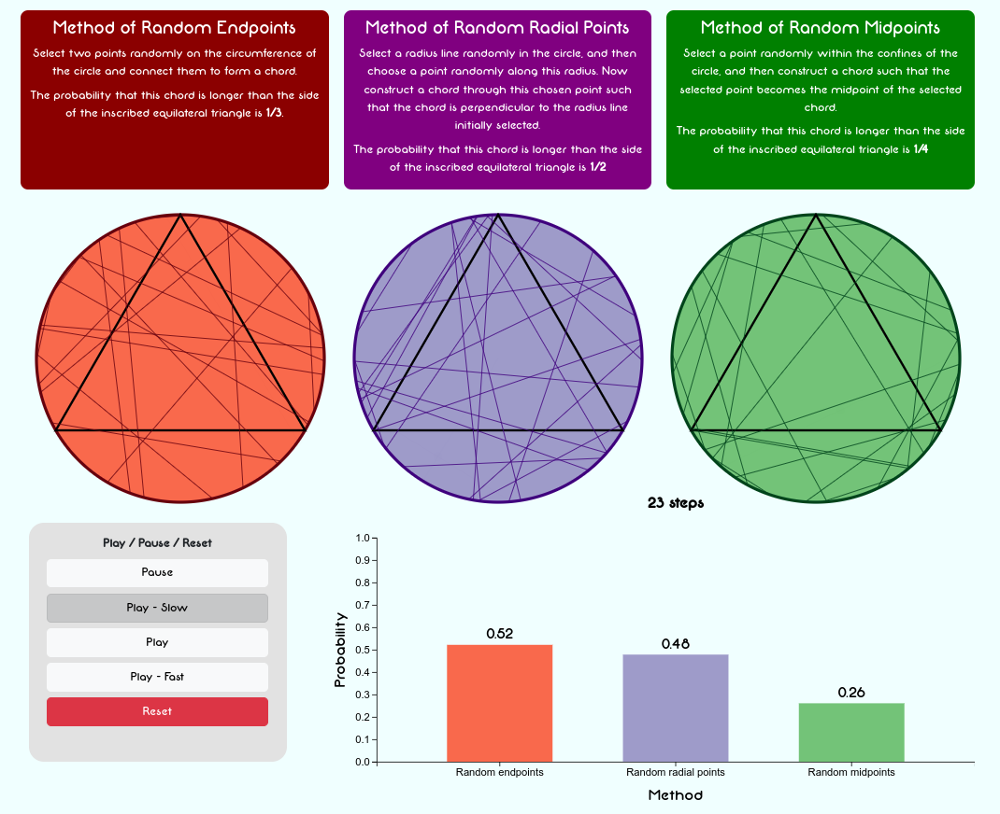

# Comparative Analysis of the Existing Solutions to Bertrand's Paradox

## MATH/PHIL 222 - Paradox and Infinity &infin;

### Overview
This repository contains the materials for my project on Bertrand's Paradox, developed as a part of the course "MATH 222 - Paradox and Infinity." This project explores the intriguing aspects of philosophical paradoxes in mathematics, with a focus on the concept of infinity and its implications in Bertrand's Paradox.

### Contents
1. **<a href="Comparative Analysis of the Existing Solutions for Bertrands Paradox.pdf">Paper:</a>** The paper was written as the final project to the course ```MATH/PHIL 222 - Paradox and Infinity```. The paper was to write a comparative analysis on the existing solutions to Bertrand's Paradox (paradox of our own choosing). The course itself relates to paradoxes, mainly related to infinity, in philosophical mathematics.
2. **<a href="">Presentation:</a>** The presentation was made to present our paper, mainly our findings about the paradox, its existing solutions, and our analysis on those solutions.
3. **Simulation:** The simulation was made to accompany the presentation, mainly in explaining the paradox and the way the method of selection leads to varying probabilities to the same question. It can be accessed <a href="" target="_blank">here</a>

### Simulation
The simulation was made using HTML and JavaScript, for which the credit heavily, and majorly goes to <a href="https://github.com/trbromley/">Tom Bromley</a>. The simulation looks like this: 


#### Acknowledgements
* Grateful to our instructor, Dr. Aeyaz Jamil Keyani for teaching this course.
* This couldn't have been possible without my group members; Lakshman Maheshwari, Meesum Ali Qazalbash, Khuzaima Ali Khan, Ali Asghar Kerai, and Jahania Shah.
